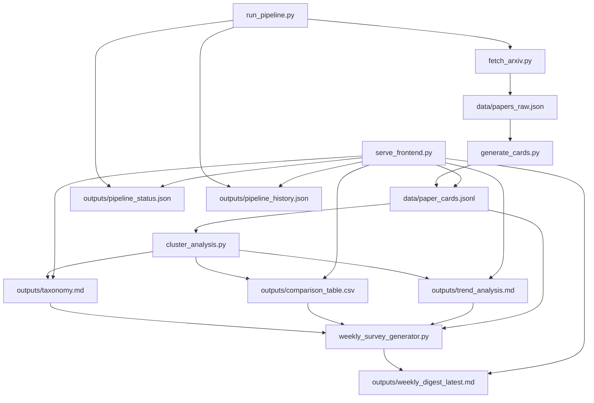

# 文献自动综述生成系统源码分析 Project Source Analysis

本文基于当前项目真实源码编写，目标不是做 README 级别的功能概述，而是帮助初学者真正看懂这个项目怎么运行、为什么这样设计、以及如何复现完整流程。

项目根目录 Project Root:

```text
C:\Users\86515\Documents\Codex\literature-survey-system
```

---

## 1. 项目总览 Project Overview

这个项目的名字是 `literature-survey-system`。它围绕某个研究主题持续跟踪 arXiv 论文，默认主题是 `Retrieval-Augmented Generation, RAG`。

它解决的问题不是“让大模型直接写综述”，而是把综述生成拆成一条可验证的知识流水线：

1. 抓取 arXiv 原始数据
2. 生成结构化 JSON 卡片
3. 基于卡片做分类与对比
4. 输出每周 Digest
5. 通过可视化面板展示当前工作流和历史运行

输入 Input：

- arXiv metadata
- paper title
- paper abstract
- prompt templates
- environment variables

输出 Output：

- `data/papers_raw.json`
- `data/paper_cards.jsonl`
- `outputs/taxonomy.md`
- `outputs/comparison_table.csv`
- `outputs/trend_analysis.md`
- `outputs/weekly_digest_latest.md`
- `outputs/weekly/YYYY-MM-DD.md`
- `outputs/pipeline_status.json`
- `outputs/pipeline_history.json`

核心价值 Core Value：

这个项目真正训练的是**知识系统设计能力**，而不是写作文能力。大模型在这里扮演的是结构化分析器 `analysis module`，而不是代写工具。

---

## 2. 项目整体结构 Overall Structure

```text
literature-survey-system/
  README.md
  PROJECT_ANALYSIS.md
  requirements.txt
  .env.example
  run_pipeline.py
  fetch_arxiv.py
  generate_cards.py
  cluster_analysis.py
  weekly_survey_generator.py
  llm_client.py
  serve_frontend.py
  workflow_metadata.py
  dashboard_app.py
  build_dashboard_exe.ps1

  prompts/
    card_extraction.txt
    taxonomy_generation.txt
    weekly_digest.txt

  frontend/
    index.html
    styles.css
    app.js
    assets/

  data/
    papers_raw.json
    paper_cards.jsonl

  outputs/
    pipeline_status.json
    pipeline_history.json
    taxonomy.md
    comparison_table.csv
    trend_analysis.md
    weekly_digest_latest.md
    weekly/

  .github/
    workflows/
      weekly.yml
```

按角色划分：

- 入口文件 Entry
  - `run_pipeline.py`
  - `serve_frontend.py`

- 核心业务逻辑 Core Logic
  - `fetch_arxiv.py`
  - `generate_cards.py`
  - `cluster_analysis.py`
  - `weekly_survey_generator.py`
  - `llm_client.py`

- 流程元数据 Workflow Metadata
  - `workflow_metadata.py`

- 前端展示 Frontend
  - `frontend/index.html`
  - `frontend/styles.css`
  - `frontend/app.js`

- 配置与提示词 Config / Prompts
  - `.env.example`
  - `prompts/*.txt`

- 数据与产物 Data / Outputs
  - `data/*`
  - `outputs/*`

---

## 3. 核心模块构成 Core Components

| 模块 Module | 职责 Responsibility | 输入 Input | 输出 Output | 依赖 Dependencies | 被谁调用 Called By |
|---|---|---|---|---|---|
| `fetch_arxiv.py` | 从 arXiv 拉取论文元数据并去重 | query, years, max_results | `papers_raw.json` | `arxiv` package | `run_pipeline.py` |
| `generate_cards.py` | 把摘要转成结构化卡片 | raw papers, prompt | `paper_cards.jsonl` | `llm_client.py` | `run_pipeline.py` |
| `cluster_analysis.py` | 生成 taxonomy、comparison、trend | paper cards | `taxonomy.md`, `comparison_table.csv`, `trend_analysis.md` | `pandas`, optional LLM | `run_pipeline.py` |
| `weekly_survey_generator.py` | 生成周报 | cards + taxonomy + comparison + trend | `weekly_digest_latest.md`, dated markdown | `llm_client.py` | `run_pipeline.py` |
| `llm_client.py` | 封装模型调用与 mock fallback | prompt, input data | JSON or text | OpenAI-compatible API | `generate_cards.py`, `cluster_analysis.py`, `weekly_survey_generator.py` |
| `serve_frontend.py` | 对外提供 dashboard API 与静态资源 | local files | local web UI | `http.server` | 用户直接运行 |
| `workflow_metadata.py` | 统一维护阶段元信息 | none | stage definitions | none | `run_pipeline.py`, `serve_frontend.py` |

---

## 4. 完整工作流 End-to-End Workflow

主流程 Main Workflow：

```text
run_pipeline.py
  -> fetch_arxiv.fetch_papers()
  -> generate_cards.generate_cards()
  -> cluster_analysis.run_analysis()
  -> weekly_survey_generator.generate_weekly_digest()
```

同时，`run_pipeline.py` 还会把每个阶段的状态写进：

```text
outputs/pipeline_status.json
outputs/pipeline_history.json
```

可视化流程 Visual Workflow：



---

## 5. 核心原理 Working Principle

### 5.1 流水线式处理 Pipeline Processing

项目采用的是非常明确的**分阶段流水线**设计，而不是一个大函数一口气干完所有事情。

这样做的好处：

1. 每一步都有独立输入和输出
2. 出错时更容易定位
3. 中间结果可以保存，便于审计
4. 每周增量更新时不用重跑全部

### 5.2 增量处理 Incremental Update

`generate_cards.py` 会先读取已有的 `paper_cards.jsonl`，然后只处理新的 `arxiv_id`。

这意味着：

- 老卡片不会重复生成
- 调用 LLM 的成本更低
- 结果更稳定

### 5.3 结构化优先 Structured-First Design

系统不直接从摘要生成整篇综述，而是先生成结构化字段：

- `problem`
- `key_idea`
- `method`
- `dataset_or_scenario`
- `metrics`
- `results_summary`
- `limitations`
- `best_fit_category`

后续的 taxonomy、趋势分析、周报全都从这些结构化字段出发。

### 5.4 可观测性 Observability

`run_pipeline.py` 不只是执行任务，还会持续写：

- 当前状态 `pipeline_status.json`
- 历史运行 `pipeline_history.json`

这使得前端可以真正显示：

- 当前跑到哪一步
- 本轮新增了哪些论文
- 最近几次运行何时执行、变化了多少内容

---

## 6. 关键文件精讲 Key Files Explained

### `run_pipeline.py`

这是主入口。你不看这个文件，就很难理解“谁先执行、谁后执行、状态什么时候写入”。

它负责：

- 解析命令行参数
- 串起四个阶段
- 写 `pipeline_status.json`
- 写 `pipeline_history.json`
- 捕获异常并标记失败阶段

### `fetch_arxiv.py`

这个文件负责和 arXiv API 对接。它会：

- 根据 query 检索论文
- 限制时间窗口
- 根据 `arxiv_id` 去重
- 输出 `papers_raw.json`
- 返回新增论文预览给监控系统

### `generate_cards.py`

这个文件是“结构化抽取”的核心。它把摘要变成 JSON 卡片，是整个项目最关键的知识转换步骤。

如果不看它，就理解不了：

- 为什么最终周报不是直接写出来的
- 为什么可以做分类和对比分析
- 如何保证“unknown”策略

### `cluster_analysis.py`

这个文件把卡片进一步压缩成“研究领域视图”。

它的价值在于：

- 把论文从单篇视角变成整体视角
- 提供 taxonomy
- 提供 comparison table
- 提供 trend analysis

### `weekly_survey_generator.py`

这个文件才真正接近“综述生成”，但它不是从原始摘要直接生成，而是从中间结构化产物生成。

### `serve_frontend.py`

这个文件把项目从“后台脚本”变成“可演示系统”。没有它，老师只能看文件；有了它，老师能直接看到工作流监控。

### `workflow_metadata.py`

这是这次优化里新增的小模块。它把阶段名集中管理，避免 `run_pipeline.py` 和 `serve_frontend.py` 重复写一套中文标签，也降低了乱码或标签不一致的风险。

---

## 7. 关键函数和调用链 Key Functions and Call Chain

### `run_pipeline.py`

- `parse_args()`
  - 解析命令行参数
- `build_status(args)`
  - 初始化状态对象
- `set_pipeline_status(...)`
  - 设置整体状态
- `mark_stage(...)`
  - 设置单个阶段状态
- `append_event(...)`
  - 记录事件流
- `append_history_entry(...)`
  - 写历史运行记录
- `main()`
  - 主调度函数

调用链：

```text
main()
  -> fetch_papers()
  -> generate_cards()
  -> run_analysis()
  -> generate_weekly_digest()
  -> append_history_entry()
```

### `fetch_arxiv.py`

- `load_existing_papers()`
  - 读取已有 raw papers
- `paper_to_dict()`
  - 把 arXiv SDK 对象转成字典
- `fetch_papers()`
  - 主抓取函数

### `generate_cards.py`

- `load_json()`
- `read_jsonl()`
- `normalize_card()`
- `generate_one_card()`
- `generate_batch_cards()`
- `generate_cards()`

### `cluster_analysis.py`

- `infer_macro_category()`
- `infer_complexity()`
- `infer_data_driven()`
- `build_comparison_rows()`
- `generate_taxonomy()`
- `generate_trend_analysis()`
- `run_analysis()`

### `weekly_survey_generator.py`

- `compact_cards()`
- `deterministic_digest()`
- `generate_weekly_digest()`

---

## 8. 数据流和控制流 Data Flow and Control Flow

### 数据流 Data Flow

```text
arXiv paper object
  -> dict paper metadata
  -> JSON raw paper list
  -> structured JSON card
  -> taxonomy / comparison / trend
  -> weekly digest markdown
```

### 控制流 Control Flow

控制流是由 `run_pipeline.py` 严格顺序推进的：

1. 初始化状态
2. 执行 `fetch`
3. 执行 `cards`
4. 执行 `analysis`
5. 执行 `weekly`
6. 写入成功或失败状态
7. 追加历史记录

判断和分发点：

- `--skip_fetch`
  - 是否跳过抓取
- `card_limit`
  - 是否限制新卡片数量
- `--no_llm_taxonomy`
  - 是否跳过 LLM taxonomy
- `--no_llm_weekly`
  - 是否用模板周报
- `client.mock`
  - 是否进入 mock mode

---

## 9. 依赖与外部组件 Dependencies and External Interfaces

### Python Libraries

- `arxiv`
  - 抓取 arXiv 论文
- `pandas`
  - 输出 comparison table
- `openai`
  - 调用 OpenAI-compatible API
- `python-dotenv`
  - 读取 `.env`

### 外部服务 External Services

- arXiv API
  - 论文元数据来源
- OpenAI-compatible LLM API
  - 结构化抽取、taxonomy、digest 生成

### 本地展示组件 Local Interfaces

- `http.server`
  - 提供 Dashboard 本地服务
- PyInstaller
  - 打包本地 EXE

---

## 10. 启动方式与运行条件 Startup and Runtime Requirements

### 运行前条件

1. 安装 Python 3.10+
2. 安装依赖 `requirements.txt`
3. 配置 `.env`
4. 如需正式结果，提供真实 `OPENAI_API_KEY`

### 主流程启动

```powershell
.\.venv\Scripts\python.exe run_pipeline.py
```

### Dashboard 启动

```powershell
.\.venv\Scripts\python.exe serve_frontend.py --host 127.0.0.1 --port 8765
```

### 轻量开发运行

```powershell
.\.venv\Scripts\python.exe run_pipeline.py --max_results 8 --card_limit 2 --batch_size 1 --no_llm_taxonomy --no_llm_weekly
```

---

## 11. 最小可理解路径 Minimum Learning Path

如果你想用最短时间看懂项目，推荐按这个顺序读：

1. `run_pipeline.py`
   - 先看总流程
2. `workflow_metadata.py`
   - 看阶段定义和状态结构
3. `fetch_arxiv.py`
   - 看原始数据从哪来
4. `generate_cards.py`
   - 看结构化抽取怎么做
5. `cluster_analysis.py`
   - 看 taxonomy 和 comparison 怎么生成
6. `weekly_survey_generator.py`
   - 看周报怎么从中间产物生成
7. `serve_frontend.py`
   - 看前端 API 怎么取数
8. `frontend/app.js`
   - 看页面如何把状态渲染出来

---

## 12. 名词对照 Glossary

| 中文 | English Original |
|---|---|
| 文献自动综述生成系统 | Literature Survey System |
| 工作流 | Workflow |
| 流水线 | Pipeline |
| 原始论文元数据 | Raw paper metadata |
| 结构化卡片 | Structured paper card |
| 分类体系 | Taxonomy |
| 方法对比表 | Comparison table |
| 趋势分析 | Trend analysis |
| 每周文献综述 | Weekly Survey Digest |
| 增量更新 | Incremental update |
| 证据来源 | Provenance |
| 模拟模式 | Mock mode |
| 实时状态 | Pipeline status |
| 运行历史 | Pipeline history |

---

## 精简复习版 Quick Review

如果只记一句话：

> 这个项目先抓取 arXiv，再把论文摘要变成结构化 JSON 卡片，再基于这些卡片生成 taxonomy、comparison、trend 和 weekly digest，最后用 dashboard 展示当前工作流与历史运行。

如果只记四个核心文件：

1. `run_pipeline.py`
2. `generate_cards.py`
3. `cluster_analysis.py`
4. `weekly_survey_generator.py`

如果只记这个原则：

> 它不是“直接让 AI 写综述”，而是“让 AI 参与结构化知识流水线中的分析环节”。
