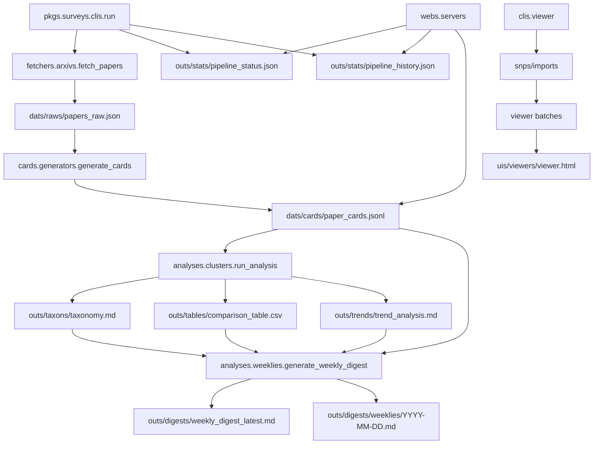

# 文献自动综述生成系统源码分析
# Project Source Analysis for arXiv Literature Survey System

本文基于当前仓库的真实代码结构编写，目标不是做 README 级别的泛泛介绍，而是帮助你真正看懂这个项目是怎么工作的。  
This document is based on the actual repository structure and aims to help you understand how the system really works.

项目根目录 Project Root:

```text
C:\Users\86515\Documents\Codex\literature-survey-system
```

---

## 1. 项目总览 Project Overview

这个项目 `arXiv Literature Survey System` 是一个围绕 `arXiv` 文献构建的自动化知识流水线 `knowledge pipeline`。  
默认主题是 `Retrieval-Augmented Generation, RAG`，但查询词 `query` 和主题 `topic` 都可以调整。

它要解决的问题不是“自动生成一篇漂亮文章”这么简单，而是把文献综述任务拆解成可验证的几个步骤：

1. 抓取论文 `fetch papers`
2. 保存原始元数据 `raw metadata`
3. 抽取结构化卡片 `structured paper cards`
4. 聚合生成 taxonomy、comparison、trend
5. 生成 weekly digest
6. 通过 UI 和状态文件展示执行过程

输入 Input:

- arXiv metadata
- paper title
- paper abstract
- prompt templates
- environment variables

输出 Output:

- `dats/raws/papers_raw.json`
- `dats/cards/paper_cards.jsonl`
- `outs/taxons/taxonomy.md`
- `outs/tables/comparison_table.csv`
- `outs/trends/trend_analysis.md`
- `outs/digests/weekly_digest_latest.md`
- `outs/digests/weeklies/YYYY-MM-DD.md`
- `outs/stats/pipeline_status.json`
- `outs/stats/pipeline_history.json`

核心价值 Core Value:

这个项目真正训练的是结构化知识系统设计 `structured knowledge system design`。  
The LLM is used as an analysis module, not as a direct ghostwriter.

---

## 2. 项目整体结构 Overall Structure

```text
literature-survey-system/
  .github/
    workflows/
      weekly.yml

  arts/
    builds/
    dists/
    logs/
    releases/

  cfgs/
    envs/
      .env
      .env.example
    pkgs/
      requirements.txt

  dats/
    cards/
      paper_cards.jsonl
    raws/
      papers_raw.json

  docs/
    analyses/
      project_analysis.md
    readmes/
      usage.txt
      viewer_usage.md

  outs/
    digests/
      weekly_digest_latest.md
      weeklies/
    stats/
      pipeline_history.json
      pipeline_status.json
    tables/
      comparison_table.csv
    taxons/
      taxonomy.md
    trends/
      trend_analysis.md

  pkgs/
    surveys/
      analyses/
        clusters.py
        weeklies.py
      cards/
        generators.py
      clients/
        llms.py
      clis/
        dashboard.py
        run.py
        serve.py
        viewer.py
      fetchers/
        arxivs.py
      metas/
        paths.py
        workflows.py
      webs/
        servers.py

  pmts/
    cards/
      card_extraction.txt
    digests/
      weekly_digest.txt
    taxons/
      taxonomy_generation.txt

  snps/
    imports/
    weeklies/

  tls/
    builds/
      *.spec
      *.ps1

  tsts/

  uis/
    assets/
      styles.css
    dashboards/
      index.html
      app.js
    viewers/
      viewer.html
      viewer.js
```

角色划分 Role Split:

- 入口层 Entry Layer
  - `pkgs/surveys/clis/run.py`
  - `pkgs/surveys/clis/serve.py`
  - `pkgs/surveys/clis/viewer.py`
- 核心业务 Core Logic
  - `fetchers/`
  - `cards/`
  - `analyses/`
  - `clients/`
- 元数据与路径 Metadata and Paths
  - `metas/paths.py`
  - `metas/workflows.py`
- 展示层 UI Layer
  - `webs/servers.py`
  - `uis/dashboards/*`
  - `uis/viewers/*`
- 配置与提示词 Config and Prompts
  - `cfgs/*`
  - `pmts/*`
- 输出与归档 Outputs and Archives
  - `dats/*`
  - `outs/*`
  - `snps/*`

---

## 3. 核心模块构成 Core Components

| 模块 Module | 职责 Responsibility | 输入 Input | 输出 Output | 依赖 Dependencies | 被谁调用 Called By |
|---|---|---|---|---|---|
| `pkgs.surveys.clis.run` | 串联完整 pipeline，并维护状态文件 | CLI args, prompts, envs | `dats/*`, `outs/*`, `pipeline_status.json` | internal modules | user, GitHub Actions |
| `pkgs.surveys.fetchers.arxivs` | 调用 arXiv API，抓取并去重 | `query`, `years`, `max_results` | `dats/raws/papers_raw.json` | `arxiv` | `run.py` |
| `pkgs.surveys.cards.generators` | 为论文生成结构化卡片 | raw papers, card prompt | `dats/cards/paper_cards.jsonl` | `llms.py` | `run.py` |
| `pkgs.surveys.analyses.clusters` | 生成 taxonomy、comparison、trend | cards | `taxonomy.md`, `comparison_table.csv`, `trend_analysis.md` | `pandas`, optional LLM | `run.py` |
| `pkgs.surveys.analyses.weeklies` | 生成每周综述 | cards + analysis artifacts | weekly digest markdown | `llms.py` | `run.py` |
| `pkgs.surveys.clients.llms` | 封装 LLM 调用、重试、mock fallback | prompt, input payload | text or JSON | OpenAI-compatible API | cards, analyses |
| `pkgs.surveys.metas.paths` | 统一管理路径与运行时路径 | none | path constants | `pathlib`, `sys` | almost all modules |
| `pkgs.surveys.metas.workflows` | 统一定义 stage metadata | none | stage schema | none | `run.py`, `servers.py` |
| `pkgs.surveys.webs.servers` | 提供 dashboard API 和静态页面 | `dats/*`, `outs/*` | local HTTP endpoints | `http.server` | `serve.py` |
| `pkgs.surveys.clis.viewer` | 独立查看器本地服务与导入读取 | imported folders, zip, files | viewer HTTP endpoints | `http.server`, `zipfile` | user, exe |

---

## 4. 完整工作流 End-to-End Workflow

主流程 Main Pipeline:

```text
python -m pkgs.surveys.clis.run
  -> fetch papers from arXiv
  -> write dats/raws/papers_raw.json
  -> generate structured paper cards
  -> write dats/cards/paper_cards.jsonl
  -> build taxonomy / comparison / trend
  -> write outs/*
  -> build weekly digest
  -> write weekly markdown
  -> update pipeline status and history
```

监控流程 Monitoring Workflow:

```text
run.py
  -> outs/stats/pipeline_status.json
  -> outs/stats/pipeline_history.json
```

本地 Dashboard 流程 Local Dashboard Workflow:

```text
python -m pkgs.surveys.clis.serve
  -> pkgs.surveys.webs.servers
  -> read dats/* and outs/*
  -> serve uis/dashboards/index.html + app.js
```

独立查看器流程 Standalone Viewer Workflow:

```text
python -m pkgs.surveys.clis.viewer
  or survey_viewer_standalone_v5.exe
  -> create snps/imports
  -> scan imported folders / zips / loose files
  -> parse dats/* and outs/*
  -> serve uis/viewers/viewer.html + viewer.js
```

流程图 Workflow Diagram:



---

## 5. 核心原理 Working Principle

### 5.1 分阶段流水线 Stage-Based Pipeline

项目不是一个“大脚本一把梭”，而是一个分阶段流水线 `stage-based pipeline`。

这样设计的原因：

1. 每一步都有独立输入输出，便于调试。
2. 中间结果会落盘，满足课程的可审计性 `auditability`。
3. 更容易做增量更新 `incremental update`。
4. 出错时可以定位到具体阶段，而不是整条链路都黑箱化。

### 5.2 结构化优先 Structured-First Design

系统遵循一个关键原则：

> 先结构化，再总结。  
> Structure first, summarize later.

也就是说，先把每篇论文变成标准字段：

- `problem`
- `key_idea`
- `method`
- `dataset_or_scenario`
- `metrics`
- `results_summary`
- `innovation_type`
- `limitations`
- `best_fit_category`
- `confidence_level`

然后 taxonomy、comparison、trend 和 weekly digest 全都建立在这些字段之上。  
This is why the project is a structured analysis system rather than a summary concatenator.

### 5.3 增量更新 Incremental Update

`pkgs/surveys/cards/generators.py` 会先读取已有的 `paper_cards.jsonl`，按 `arxiv_id` 建索引，只处理新论文。  
This saves API cost, keeps old outputs stable, and makes weekly updating practical.

### 5.4 可观测性 Observability

`run.py` 不只是调度器，它还负责持续维护工作流状态：

- 当前阶段 `current_stage`
- 整体状态 `status`
- 最近事件 `recent_events`
- 最近新增论文 `recent_new_papers`
- 阶段进度 `progress_current`, `progress_total`, `progress_percent`

因此这个项目不仅“能跑”，而且“能被看见怎么跑”。  
The system is observable, not opaque.

### 5.5 本地轻服务 Local Lightweight Service

`pkgs/surveys/webs/servers.py` 和 `pkgs/surveys/clis/viewer.py` 都采用标准库 `http.server` 路线，而不是完整 Web 框架。  
That choice keeps the project lightweight, easy to package, and sufficient for a local academic demo.

---

## 6. 关键文件精讲 Key Files Explained

### `pkgs/surveys/clis/run.py`

这是总调度入口 `main orchestrator`。  
它负责：

- 解析 CLI 参数 `parse_args`
- 确保目录存在 `ensure_layout`
- 初始化状态 `build_status`
- 串起四个阶段：`fetch -> cards -> analysis -> weekly`
- 写入 `pipeline_status.json` 和 `pipeline_history.json`

如果不看这个文件，你很难建立全局控制流。

### `pkgs/surveys/fetchers/arxivs.py`

这是抓取层 `fetch layer`。  
它负责：

- 调 arXiv API
- 把 SDK 返回对象转成普通字典
- 基于 `arxiv_id` 去重
- 写入 `dats/raws/papers_raw.json`

### `pkgs/surveys/cards/generators.py`

这是最核心的结构化抽取层 `card extraction layer`。  
它负责：

- 读取原始论文
- 跳过已有卡片
- 调用 `LLMClient`
- 校验字段
- 补 `unknown`
- 写入 `paper_cards.jsonl`

这一层决定了系统是不是“结构化分析系统”。

### `pkgs/surveys/clients/llms.py`

这是模型适配层 `LLM adapter layer`。  
它负责：

- 读取 `OPENAI_API_KEY`
- 支持 `OPENAI_BASE_URL`
- 封装 `chat_json` 与 `chat_text`
- 处理超时、重试和 fallback
- 支持 `mock mode`

如果不看它，你就不知道为什么有时走真模型，有时走 mock。

### `pkgs/surveys/analyses/clusters.py`

这是分析聚合层 `analysis aggregation layer`。  
它会把多张论文卡片提升为领域级输出：

1. `taxonomy.md`
2. `comparison_table.csv`
3. `trend_analysis.md`

### `pkgs/surveys/analyses/weeklies.py`

这是最终周报生成层 `weekly synthesis layer`。  
注意它不是直接对着摘要写周报，而是读取：

- structured cards
- taxonomy
- comparison table
- trend analysis

然后再生成 `weekly digest`。

### `pkgs/surveys/webs/servers.py`

这是 Dashboard 的本地服务层 `dashboard serving layer`。  
它负责把 `dats/*`、`outs/*` 变成前端可消费的 JSON API。

### `pkgs/surveys/clis/viewer.py`

这是 Standalone Viewer 的后端入口。  
它和普通 dashboard 不一样的地方在于：

- 会自动创建 `snps/imports`
- 支持目录导入、zip 导入、散文件导入
- 能把多个批次结果堆叠显示
- 适合查看 GitHub Actions 下载回来的历史周次结果

### `pkgs/surveys/metas/paths.py`

这是路径注册中心 `path registry`。  
它统一定义了 `cfgs`、`dats`、`outs`、`uis`、`snps`、`arts` 等路径，并处理 exe 运行时路径。

这也是为什么 exe 模式下会把导入目录创建在 `arts/dists/snps/imports/` 附近。

### `pkgs/surveys/metas/workflows.py`

这是阶段元数据中心 `workflow metadata registry`。  
它统一定义 stage id、双语标签、默认状态结构，所以前后端都能共享同一套阶段语义。

---

## 7. 关键函数和调用链 Key Functions and Call Chain

### `pkgs/surveys/clis/run.py`

关键函数：

- `ensure_layout()`
- `build_status(args)`
- `append_event(status, stage_id, message, payload)`
- `mark_stage(...)`
- `set_stage_stats(status, stage_id, stats)`
- `append_history_entry(status)`
- `main()`

主调用链：

```text
main()
  -> fetch_papers()
  -> generate_cards()
  -> run_analysis()
  -> generate_weekly_digest()
  -> append_history_entry()
```

### `pkgs/surveys/cards/generators.py`

关键函数通常包括：

- `read_jsonl()`
- `normalize_card()`
- `generate_one_card()`
- `generate_cards()`

典型调用链：

```text
generate_cards()
  -> read raw papers
  -> read existing cards
  -> call LLM client
  -> normalize fields
  -> append JSONL records
```

### `pkgs/surveys/analyses/clusters.py`

关键函数：

- `build_comparison_rows()`
- `infer_complexity()`
- `infer_data_driven()`
- `generate_taxonomy()`
- `generate_trend_analysis()`
- `run_analysis()`

### `pkgs/surveys/analyses/weeklies.py`

关键函数：

- `compact_cards()`
- `deterministic_digest()`
- `generate_weekly_digest()`

### `pkgs/surveys/clis/viewer.py`

关键函数：

- `detect_kind()`
- `batch_from_directory()`
- `batch_from_zip()`
- `batch_from_loose_files()`
- `load_import_batches()`
- `imports_meta()`

这里的调用链是：

```text
viewer server
  -> scan imports folder
  -> build batch payloads
  -> expose /api/imports/meta
  -> expose /api/imports/load
  -> frontend viewer.js renders stacked results
```

---

## 8. 数据流和控制流 Data Flow and Control Flow

### 数据流 Data Flow

```text
arXiv SDK result
  -> paper dict
  -> papers_raw.json
  -> paper_cards.jsonl
  -> taxonomy / comparison / trend
  -> weekly digest
  -> dashboard / viewer visualization
```

拆开看：

1. `arxivs.py` 把远端论文元数据拉到本地
2. `generators.py` 把摘要压缩成标准字段
3. `clusters.py` 把多张卡片聚合成领域分析
4. `weeklies.py` 把领域分析转成短综述
5. `servers.py` 和 `viewer.py` 把文件重新组织成可视化页面

### 控制流 Control Flow

控制流由 `run.py` 统一推进：

1. 初始化目录和状态
2. 执行 `fetch`
3. 执行 `cards`
4. 执行 `analysis`
5. 执行 `weekly`
6. 写入 `completed` 或 `failed`
7. 追加历史记录

关键判断点：

- `--skip_fetch`
- `--card_limit`
- `--batch_size`
- `--no_llm_taxonomy`
- `--no_llm_weekly`
- `mock mode`

---

## 9. 依赖与外部组件 Dependencies and External Interfaces

### Python Libraries

- `arxiv`
  - 用于连接 arXiv 数据源
- `openai`
  - 用于调用 OpenAI-compatible API
- `pandas`
  - 用于整理比较表和分析数据
- `python-dotenv`
  - 用于加载 `.env`

### External Services

- arXiv API
  - 原始论文来源
- OpenAI-compatible LLM API
  - 结构化抽取、taxonomy 总结、weekly digest 生成

### Local Interfaces

- `http.server`
  - 提供 dashboard / viewer 的本地 HTTP 服务
- PyInstaller
  - 用于打包 exe 查看器
- GitHub Actions
  - 用于每周自动执行远程 pipeline

---

## 10. 启动方式与运行条件 Startup and Runtime Requirements

### 运行前需要准备 Runtime Requirements

1. Python 3.11+
2. `cfgs/pkgs/requirements.txt`
3. `cfgs/envs/.env`
4. 正式生成时需要真实 LLM API，而不是 mock

### 安装依赖 Install

```powershell
python -m pip install -r cfgs/pkgs/requirements.txt
```

### 运行主流程 Run Pipeline

```powershell
python -m pkgs.surveys.clis.run
```

### 开发期轻量测试 Development Smoke Test

```powershell
python -m pkgs.surveys.clis.run --max_results 8 --card_limit 2 --batch_size 1 --no_llm_taxonomy --no_llm_weekly
```

### 启动本地 Dashboard

```powershell
python -m pkgs.surveys.clis.serve --host 127.0.0.1 --port 8765
```

### 启动 Standalone Viewer

```powershell
python -m pkgs.surveys.clis.viewer
```

或直接运行：

```text
arts/dists/survey_viewer_standalone_v5.exe
```

---

## 11. 最小可理解路径 Minimum Learning Path

如果你想用最短时间看懂项目，推荐阅读顺序：

1. `pkgs/surveys/clis/run.py`
   - 建立总流程概念
2. `pkgs/surveys/metas/workflows.py`
   - 看阶段定义
3. `pkgs/surveys/metas/paths.py`
   - 看目录与运行时路径
4. `pkgs/surveys/fetchers/arxivs.py`
   - 看抓取逻辑
5. `pkgs/surveys/cards/generators.py`
   - 看结构化抽取
6. `pkgs/surveys/clients/llms.py`
   - 看模型调用和 fallback
7. `pkgs/surveys/analyses/clusters.py`
   - 看 taxonomy / comparison / trend
8. `pkgs/surveys/analyses/weeklies.py`
   - 看 weekly digest
9. `pkgs/surveys/webs/servers.py`
   - 看 dashboard 数据接口
10. `pkgs/surveys/clis/viewer.py`
   - 看独立查看器的导入机制
11. `uis/viewers/viewer.js`
   - 看前端怎样渲染多批结果

---

## 12. 名词对照 Glossary

| 中文 | English Original |
|---|---|
| 文献自动综述生成系统 | Literature Survey System |
| 工作流 | Workflow |
| 流水线 | Pipeline |
| 原始元数据 | Raw metadata |
| 结构化论文卡片 | Structured paper card |
| 分类体系 | Taxonomy |
| 方法对比表 | Comparison table |
| 趋势分析 | Trend analysis |
| 每周综述 | Weekly Survey Digest |
| 可审计性 | Auditability |
| 增量更新 | Incremental update |
| 证据来源 | Evidence source |
| 模拟模式 | Mock mode |
| 状态快照 | Pipeline status |
| 运行历史 | Pipeline history |
| 本地 Dashboard | Local dashboard |
| 独立查看器 | Standalone viewer |
| 投递箱目录 | Import drop folder |

---

## 初学者复习精简版 Quick Review for Beginners

一句话理解：

> 这个项目先从 arXiv 抓论文，再把摘要变成结构化 JSON 卡片，再基于卡片生成 taxonomy、comparison、trend 和 weekly digest，最后通过 dashboard 和 viewer 把整个过程展示出来。

如果你只记四个核心文件：

1. `pkgs/surveys/clis/run.py`
2. `pkgs/surveys/cards/generators.py`
3. `pkgs/surveys/analyses/clusters.py`
4. `pkgs/surveys/analyses/weeklies.py`

如果你只记一个原则：

> 它不是“直接让 AI 写综述”，而是“让 AI 参与结构化知识流水线中的分析环节”。
