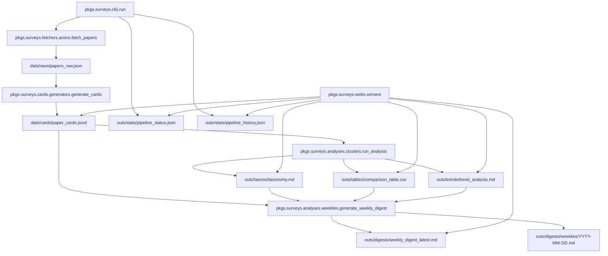

# 文献自动综述生成系统源码分析 Project Source Analysis

本文基于当前仓库真实代码结构编写，目标不是做 README 级功能简介，而是帮助你顺着源码看懂这个项目怎样运行、为什么这样设计、以及各模块怎样彼此配合。

项目根目录 Project Root:

```text
C:\Users\86515\Documents\Codex\literature-survey-system
```

---

## 1. 项目总览 Project Overview

这个项目 `arxiv-literature-survey-system` 是一个围绕 arXiv 论文的自动化知识流水线 `pipeline system`。默认主题是 `Retrieval-Augmented Generation, RAG`，但查询词 `query` 和主题标签 `topic` 都可以配置。

它解决的问题不是“直接让大模型代写综述”，而是把综述工作拆成一条可验证的分析链路：

1. 从 arXiv 抓取原始论文元数据 `raw metadata`
2. 把标题和摘要转成结构化论文卡片 `structured paper cards`
3. 基于卡片生成分类体系 `taxonomy`、对比表 `comparison table`、趋势分析 `trend analysis`
4. 再从这些中间产物生成每周综述 `weekly digest`
5. 通过本地 Dashboard 和 Viewer 查看当前状态与历史结果

输入 Input:

- arXiv metadata
- paper title
- paper abstract
- prompt templates
- environment variables

输出 Output:

- `dats/raws/papers_raw.json`
- `dats/cards/paper_cards.jsonl`
- `outs/taxons/taxonomy.md`
- `outs/tables/comparison_table.csv`
- `outs/trends/trend_analysis.md`
- `outs/digests/weekly_digest_latest.md`
- `outs/digests/weeklies/YYYY-MM-DD.md`
- `outs/stats/pipeline_status.json`
- `outs/stats/pipeline_history.json`

核心价值 Core Value:

这个项目训练的是结构化知识系统设计 `structured knowledge system design`。大模型 `LLM` 在这里主要承担“结构化分析模块 `analysis module`”的职责，而不是直接充当写手。

---

## 2. 项目整体结构 Overall Structure

当前目录树 Current Directory Tree:

```text
literature-survey-system/
  .github/
    workflows/
      weekly.yml

  arts/
    builds/
    dists/
    logs/
    releases/

  cfgs/
    envs/
      .env
      .env.example
    pkgs/
      requirements.txt

  dats/
    cards/
      paper_cards.jsonl
    raws/
      papers_raw.json

  docs/
    analyses/
      project_analysis.md
    readmes/
      usage.txt

  outs/
    digests/
      weekly_digest_latest.md
      weeklies/
    stats/
      pipeline_history.json
      pipeline_status.json
    tables/
      comparison_table.csv
    taxons/
      taxonomy.md
    trends/
      trend_analysis.md

  pkgs/
    surveys/
      analyses/
        clusters.py
        weeklies.py
      cards/
        generators.py
      clients/
        llms.py
      clis/
        dashboard.py
        run.py
        serve.py
      fetchers/
        arxivs.py
      metas/
        paths.py
        workflows.py
      webs/
        servers.py

  pmts/
    cards/
      card_extraction.txt
    digests/
      weekly_digest.txt
    taxons/
      taxonomy_generation.txt

  tls/
    builds/
      build_dashboard_exe.ps1
      survey_dashboard_modern.spec

  tsts/

  uis/
    assets/
      knowledge-map.png
      styles.css
    dashboards/
      app.js
      index.html
    viewers/
      viewer.html
      viewer.js

  .gitignore
  pyproject.toml
```

目录职责 Directory Roles:

- 入口命令 Entry Commands
  - `pkgs/surveys/clis/run.py`
  - `pkgs/surveys/clis/serve.py`
  - `pkgs/surveys/clis/dashboard.py`

- 核心业务逻辑 Core Logic
  - `pkgs/surveys/fetchers/arxivs.py`
  - `pkgs/surveys/cards/generators.py`
  - `pkgs/surveys/analyses/clusters.py`
  - `pkgs/surveys/analyses/weeklies.py`
  - `pkgs/surveys/clients/llms.py`

- 元数据与路径管理 Metadata and Paths
  - `pkgs/surveys/metas/paths.py`
  - `pkgs/surveys/metas/workflows.py`

- 本地 Web 展示 Local Web UI
  - `pkgs/surveys/webs/servers.py`
  - `uis/dashboards/*`
  - `uis/viewers/*`

- 配置与提示词 Config and Prompts
  - `cfgs/envs/.env.example`
  - `cfgs/pkgs/requirements.txt`
  - `pmts/*`

- 数据与产物 Data and Artifacts
  - `dats/*`
  - `outs/*`

- 打包工具 Packaging Tools
  - `tls/builds/build_dashboard_exe.ps1`
  - `tls/builds/survey_dashboard_modern.spec`

---

## 3. 核心模块构成 Core Components

| 模块 Module | 责任 Responsibility | 输入 Input | 输出 Output | 依赖 Dependencies | 被谁调用 Called By |
|---|---|---|---|---|---|
| `pkgs.surveys.clis.run` | 串联完整主流程，写状态和历史 | CLI args, prompts, local files | 所有 `dats` 与 `outs` 产物 | 内部所有核心模块 | 用户、GitHub Actions |
| `pkgs.surveys.fetchers.arxivs` | 从 arXiv 抓取论文并去重 | `query`, `years`, `max_results` | `dats/raws/papers_raw.json` | `arxiv` package | `pkgs.surveys.clis.run` |
| `pkgs.surveys.cards.generators` | 生成结构化 JSONL 卡片 | raw papers, card prompt | `dats/cards/paper_cards.jsonl` | `pkgs.surveys.clients.llms` | `pkgs.surveys.clis.run` |
| `pkgs.surveys.analyses.clusters` | 生成 taxonomy、comparison、trend | paper cards | `outs/taxons/taxonomy.md`, `outs/tables/comparison_table.csv`, `outs/trends/trend_analysis.md` | `pandas`, optional LLM | `pkgs.surveys.clis.run` |
| `pkgs.surveys.analyses.weeklies` | 生成 weekly digest | cards + analysis artifacts | `outs/digests/*` | `pkgs.surveys.clients.llms` | `pkgs.surveys.clis.run` |
| `pkgs.surveys.clients.llms` | LLM 调用、mock fallback、重试 | prompt, input data | JSON or text | OpenAI-compatible API | cards / analyses |
| `pkgs.surveys.metas.paths` | 集中定义路径常量和运行时路径 | none | path constants | `pathlib` | 多个模块 |
| `pkgs.surveys.metas.workflows` | 集中定义阶段标签与状态结构 | none | stage metadata | none | `run.py`, `servers.py` |
| `pkgs.surveys.webs.servers` | 本地 API + 静态文件服务 | local `dats` and `outs` | dashboard/viewer data endpoints | `http.server` | `serve.py`, `dashboard.py` |

---

## 4. 完整工作流 End-to-End Workflow

主流程 Main Workflow:

```text
pkgs/surveys/clis/run.py
  -> pkgs/surveys/fetchers/arxivs.py
  -> pkgs/surveys/cards/generators.py
  -> pkgs/surveys/analyses/clusters.py
  -> pkgs/surveys/analyses/weeklies.py
```

状态监控 Workflow Monitoring:

```text
pkgs/surveys/clis/run.py
  -> outs/stats/pipeline_status.json
  -> outs/stats/pipeline_history.json
```

本地查看链路 Local Viewing Workflow:

```text
pkgs/surveys/clis/serve.py
  -> pkgs/surveys/webs/servers.py
  -> reads dats/* + outs/*
  -> serves uis/dashboards/* + uis/viewers/*
```

流程图 Workflow Diagram:



---

## 5. 核心原理 Working Principle

### 5.1 分阶段流水线 Stage-Based Pipeline

项目采用的是分阶段流水线 `stage-based pipeline`，而不是一个大脚本一次性完成全部工作。原因很实际：

1. 每一步都有独立输入输出，便于调试
2. 中间结果可保存，满足课程的“可审计性 `auditability`”
3. 增量更新更容易实现
4. 失败时可以定位具体阶段，而不是整条链路一锅端

### 5.2 结构化优先 Structured-First Design

本系统的关键原则是：

> 先结构化，再总结；先卡片，再综述。

也就是先生成每篇论文的结构化字段：

- `problem`
- `key_idea`
- `method`
- `dataset_or_scenario`
- `metrics`
- `results_summary`
- `innovation_type`
- `limitations`
- `best_fit_category`
- `confidence_level`

然后 taxonomy、comparison、trend、weekly digest 全部基于这些字段生成，而不是直接拼摘要。

### 5.3 增量处理 Incremental Update

`pkgs/surveys/cards/generators.py` 先读取已有 `paper_cards.jsonl`，按 `arxiv_id` 构建索引，只处理新增论文。这样做有三个好处：

1. 节省 API 调用成本
2. 保持已有结果稳定
3. 支持每周持续更新，而不是每次从零开始

### 5.4 可观测性 Observability

`pkgs/surveys/clis/run.py` 不只负责执行，还负责持续写入运行状态。它维护两类状态文件：

- `outs/stats/pipeline_status.json`
  - 当前这次运行到了哪一步
  - 当前阶段的进度、详情、最近事件

- `outs/stats/pipeline_history.json`
  - 过去若干次运行的摘要
  - 方便前端显示历史记录

所以这个项目不仅是“会跑”，还是“看得见怎么跑”。

### 5.5 本地 Web 服务 Local Web Serving

`pkgs/surveys/webs/servers.py` 使用的是标准库 `http.server`，不是 Flask 或 FastAPI。原因是当前需求更像一个轻量本地查看器 `local viewer`：

1. 依赖少
2. 打包成 EXE 更轻
3. 足够支持静态页面 + JSON API

---

## 6. 关键文件精讲 Key Files Explained

### `pkgs/surveys/clis/run.py`

这是主入口 `main entry`。如果只读一个文件，优先读它。它负责：

- 解析参数 `parse_args`
- 初始化状态 `build_status`
- 串起四个阶段
- 写入 `pipeline_status.json` 和 `pipeline_history.json`
- 在失败时把对应阶段标记为 `failed`

不看这个文件，你就很难建立全局控制流。

### `pkgs/surveys/fetchers/arxivs.py`

这是抓取层 `fetch layer`。它负责：

- 调 arXiv API
- 将 SDK 返回对象转换成字典
- 根据 `arxiv_id` 去重
- 写入 `dats/raws/papers_raw.json`
- 向 `run.py` 回报抓取过程事件

### `pkgs/surveys/cards/generators.py`

这是知识抽取层 `card extraction layer`，也是课程要求中最核心的模块之一。它负责：

- 读取原始论文列表
- 跳过已有卡片
- 调用 `LLMClient`
- 校验字段
- 缺失字段填 `unknown`
- 写入 `dats/cards/paper_cards.jsonl`

这一步决定了系统是不是“结构化分析系统”，而不是“摘要拼接器”。

### `pkgs/surveys/clients/llms.py`

这是模型适配层 `LLM adapter layer`。它做了几件很重要的事：

- 从环境变量读取 `OPENAI_API_KEY`
- 支持 `OPENAI_BASE_URL`
- 统一封装 `chat_json` 和 `chat_text`
- 支持 `temperature`
- 没有 API key 或调用失败时可以进入 `mock mode`
- 记录本次是否用了 mock fallback

它把上层模块和具体模型 API 解耦了。

### `pkgs/surveys/analyses/clusters.py`

这是分析层 `analysis layer`。它负责从卡片生成三个核心产物：

1. `taxonomy.md`
2. `comparison_table.csv`
3. `trend_analysis.md`

也就是说，它把“单篇论文信息”转成“领域全景视图”。

### `pkgs/surveys/analyses/weeklies.py`

这是综述汇总层 `weekly synthesis layer`。它并不直接读 arXiv 原始摘要来写综述，而是基于：

- structured cards
- taxonomy
- comparison table
- trend analysis

来生成最终的 `weekly digest`。

### `pkgs/surveys/webs/servers.py`

这是本地展示层 `web serving layer`。它负责：

- 提供 `/api/summary`
- 提供 `/api/cards`
- 提供 `/api/pipeline/status`
- 提供 `/api/pipeline/history`
- 提供静态文件 `/assets/*`、`/dashboards/*`、`/viewers/*`

没有这个文件，项目就是一组离线脚本；有了它，项目就能演示“系统正在怎样工作”。

### `pkgs/surveys/metas/paths.py`

这是路径中心 `path registry`。它统一定义 `cfgs`、`dats`、`outs`、`uis` 等目录常量，并处理打包后的运行时路径 `runtime path`。这个设计可以避免每个模块都自己拼路径，降低目录重构带来的破坏面。

### `pkgs/surveys/metas/workflows.py`

这是阶段元数据中心 `workflow metadata registry`。它集中维护：

- 阶段顺序 `STAGE_SEQUENCE`
- 中英双语标签 `label_zh`, `label_en`
- 标准阶段状态结构 `build_stage_entry`

所以 `run.py` 和 `servers.py` 可以共用同一套阶段定义，不会一个地方叫“结构化抽取”，另一个地方叫“生成卡片”。

---

## 7. 关键函数和调用链 Key Functions and Call Chain

### `pkgs/surveys/clis/run.py`

关键函数 Key Functions:

- `parse_args()`
  - 解析命令行参数
- `ensure_layout()`
  - 确保 `dats`、`outs` 等目录存在
- `build_status(args)`
  - 生成初始状态对象
- `append_event(status, stage_id, message, payload)`
  - 写最近事件流
- `mark_stage(...)`
  - 更新某个阶段状态
- `set_stage_stats(...)`
  - 为某阶段记录统计数据
- `append_history_entry(status)`
  - 将本次运行摘要写入历史
- `fetch_progress_handler(status)`
  - 生成抓取阶段的回调
- `cards_progress_handler(status)`
  - 生成卡片阶段的回调
- `main()`
  - 主调度函数

主调用链 Main Call Chain:

```text
main()
  -> fetch_papers()
  -> generate_cards()
  -> run_analysis()
  -> generate_weekly_digest()
  -> append_history_entry()
```

### `pkgs/surveys/fetchers/arxivs.py`

关键函数:

- `paper_to_dict()`
  - 把 arXiv 返回对象转换成 JSON 友好字典
- `load_existing_papers()`
  - 读取已有 raw papers
- `fetch_papers()`
  - 主抓取函数

### `pkgs/surveys/cards/generators.py`

关键函数:

- `load_json()`
- `read_jsonl()`
- `normalize_card()`
- `generate_one_card()`
- `generate_batch_cards()`
- `generate_cards()`

它的内部调用关系大致是：

```text
generate_cards()
  -> load_json(raw_path)
  -> read_jsonl(cards_path)
  -> LLMClient(...)
  -> generate_batch_cards() / generate_one_card()
  -> normalize_card()
  -> write_jsonl_atomic(cards_path)
```

### `pkgs/surveys/analyses/clusters.py`

关键函数:

- `build_comparison_rows()`
- `infer_complexity()`
- `infer_data_driven()`
- `generate_taxonomy()`
- `generate_trend_analysis()`
- `run_analysis()`

### `pkgs/surveys/analyses/weeklies.py`

关键函数:

- `compact_cards()`
- `deterministic_digest()`
- `generate_weekly_digest()`

### `pkgs/surveys/webs/servers.py`

关键函数:

- `read_pipeline_status()`
- `build_fallback_pipeline_status()`
- `api_summary()`
- `filter_cards()`
- `SurveyHandler.do_GET()`
- `SurveyHandler.serve_json()`
- `SurveyHandler.serve_static()`

---

## 8. 数据流和控制流 Data Flow and Control Flow

### 数据流 Data Flow

数据是怎样一步步变形的：

```text
arXiv SDK result
  -> paper dict
  -> dats/raws/papers_raw.json
  -> structured paper card
  -> dats/cards/paper_cards.jsonl
  -> taxonomy / comparison / trend artifacts
  -> weekly digest markdown
```

更细一点可以理解成：

1. `arxivs.py` 把远端论文元数据拉到本地
2. `generators.py` 把论文摘要压缩成标准字段
3. `clusters.py` 把多张卡片聚合成领域分析
4. `weeklies.py` 把领域分析再压缩成教师可读的周报

### 控制流 Control Flow

控制流由 `pkgs/surveys/clis/run.py` 统一推进：

1. 初始化目录和状态
2. 执行 `fetch`
3. 执行 `cards`
4. 执行 `analysis`
5. 执行 `weekly`
6. 写入 `completed` 或 `failed`
7. 追加历史记录

关键判断点 Key Decision Points:

- `--skip_fetch`
  - 是否跳过抓取，直接复用已有 `papers_raw.json`
- `--card_limit`
  - 是否只处理少量新卡片，方便开发测试
- `--batch_size`
  - 每次 LLM 批量处理多少篇
- `--no_llm_taxonomy`
  - taxonomy 是否使用 LLM 辅助
- `--no_llm_weekly`
  - weekly digest 是否使用 LLM 辅助
- `client.mock`
  - 当前是否处于 mock 模式

---

## 9. 依赖与外部组件 Dependencies and External Interfaces

### Python Libraries

- `arxiv`
  - 连接 arXiv 数据源
- `openai`
  - 调用 OpenAI-compatible API
- `pandas`
  - 生成和处理 comparison table
- `python-dotenv`
  - 加载 `cfgs/envs/.env`

### 外部服务 External Services

- arXiv API
  - 原始论文来源
- OpenAI-compatible LLM API
  - 结构化抽取、taxonomy 总结、weekly digest 生成

### 本地接口 Local Interfaces

- `http.server`
  - 提供 Dashboard / Viewer 所需 API 和静态资源
- PyInstaller
  - 用于打包 EXE 查看器
- GitHub Actions
  - 每周远程自动运行流水线

---

## 10. 启动方式与运行条件 Startup and Runtime Requirements

### 运行前条件 Runtime Requirements

1. 安装 Python 3.11+
2. 安装依赖 `cfgs/pkgs/requirements.txt`
3. 在 `cfgs/envs/.env` 配置 API 信息
4. 如需正式作业结果，使用真实 LLM API，而不是 mock 模式

### 安装依赖 Install Dependencies

```powershell
.\.venv\Scripts\python.exe -m pip install -r cfgs/pkgs/requirements.txt
```

### 启动主流程 Run The Pipeline

```powershell
.\.venv\Scripts\python.exe -m pkgs.surveys.clis.run
```

### 开发期轻量测试 Development Smoke Test

```powershell
.\.venv\Scripts\python.exe -m pkgs.surveys.clis.run --max_results 8 --card_limit 2 --batch_size 1 --no_llm_taxonomy --no_llm_weekly
```

### 启动本地 Dashboard Start Local Dashboard

```powershell
.\.venv\Scripts\python.exe -m pkgs.surveys.clis.serve --host 127.0.0.1 --port 8765
```

### 自动打开版 Dashboard Open-In-Browser Dashboard

```powershell
.\.venv\Scripts\python.exe -m pkgs.surveys.clis.dashboard
```

### Standalone Viewer

```powershell
python -m http.server 8877
```

然后打开 Then Open:

```text
http://127.0.0.1:8877/uis/viewers/viewer.html
```

---

## 11. 最小可理解路径 Minimum Learning Path

如果你想用最短时间真正看懂源码，推荐按这个顺序读：

1. `pkgs/surveys/clis/run.py`
   - 先建立主流程和状态观
2. `pkgs/surveys/metas/workflows.py`
   - 看四个阶段的统一定义
3. `pkgs/surveys/metas/paths.py`
   - 看路径是怎样被统一管理的
4. `pkgs/surveys/fetchers/arxivs.py`
   - 看原始论文从哪里来
5. `pkgs/surveys/cards/generators.py`
   - 看结构化抽取的核心逻辑
6. `pkgs/surveys/clients/llms.py`
   - 看模型调用和 mock fallback
7. `pkgs/surveys/analyses/clusters.py`
   - 看 taxonomy 和 comparison 怎样生成
8. `pkgs/surveys/analyses/weeklies.py`
   - 看 weekly digest 怎样从中间产物生成
9. `pkgs/surveys/webs/servers.py`
   - 看 Dashboard / Viewer 怎样读这些文件并展示
10. `uis/dashboards/app.js`
   - 看前端怎样渲染 pipeline status 和 cards

---

## 12. 名词对照 Glossary

| 中文 | English Original |
|---|---|
| 文献自动综述生成系统 | Literature Survey System |
| 流水线 | Pipeline |
| 工作流 | Workflow |
| 原始论文元数据 | Raw paper metadata |
| 结构化论文卡片 | Structured paper card |
| 分类体系 | Taxonomy |
| 方法对比表 | Comparison table |
| 趋势分析 | Trend analysis |
| 每周综述 | Weekly Survey Digest |
| 增量更新 | Incremental update |
| 证据来源 | Evidence source |
| 审计字段 | Audit fields |
| 模拟模式 | Mock mode |
| 运行状态 | Pipeline status |
| 运行历史 | Pipeline history |
| 本地查看器 | Local viewer |
| 本地 Dashboard | Local dashboard |

---

## 精简复习版 Quick Review

如果只记一句话：

> 这个项目先抓 arXiv，再把摘要变成结构化 JSON 卡片，再基于卡片生成 taxonomy、comparison、trend 和 weekly digest，最后通过本地 Dashboard / Viewer 展示整个工作流和历史结果。

如果只记四个关键文件：

1. `pkgs/surveys/clis/run.py`
2. `pkgs/surveys/cards/generators.py`
3. `pkgs/surveys/analyses/clusters.py`
4. `pkgs/surveys/analyses/weeklies.py`

如果只记一个原则：

> 它不是“直接让 AI 写综述”，而是“让 AI 参与结构化知识流水线中的分析环节”。
