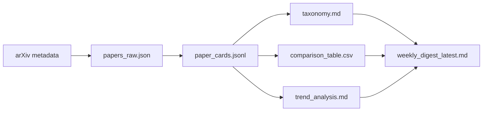

# 工作流与产物说明
# Workflow and Artifact Guide

这份文档专门解释这个项目的工作流 `workflow`、数据流 `data flow`、状态文件 `status files`、归档快照 `snapshots` 和本地查看方式。  
This document focuses on the system workflow, data flow, status files, snapshots, and local viewing flow.

---

## 1. 为什么要单独写这份文档
## Why This Document Exists

`README.md` 负责快速上手。  
`project_analysis.md` 负责源码级拆解。  
这份 `workflow_guide.md` 负责把“程序怎么跑”和“结果怎么被保存、查看、归档”讲清楚。

它更适合：

- 给老师演示整体流程
- 自己复盘每个阶段产物
- 解释 GitHub Actions 和本地查看器的关系

---

## 2. 主工作流 Main Workflow

主流程入口是：

```text
python -m pkgs.surveys.clis.run
```

对应源码入口：

```text
pkgs/surveys/clis/run.py
```

主流程分为四个阶段：

1. `fetch`
2. `cards`
3. `analysis`
4. `weekly`

对应含义如下：

| 阶段 Stage | 作用 Purpose | 主要输出 Main Output |
|---|---|---|
| `fetch` | 从 arXiv 抓取论文并去重 | `dats/raws/papers_raw.json` |
| `cards` | 为每篇论文生成结构化卡片 | `dats/cards/paper_cards.jsonl` |
| `analysis` | 生成 taxonomy、comparison、trend | `outs/taxons/taxonomy.md`, `outs/tables/comparison_table.csv`, `outs/trends/trend_analysis.md` |
| `weekly` | 基于结构化产物生成每周综述 | `outs/digests/weekly_digest_latest.md`, `outs/digests/weeklies/YYYY-MM-DD.md` |

---

## 3. 数据是怎么流动的
## How Data Flows Through the System

数据流不是一步到位，而是逐层压缩和抽象：



可以把它理解成：

1. `papers_raw.json` 保存“论文原始事实”
2. `paper_cards.jsonl` 保存“每篇论文的结构化理解”
3. `taxonomy.md` / `comparison_table.csv` / `trend_analysis.md` 保存“跨论文的领域总结”
4. `weekly_digest_latest.md` 保存“最终给人读的短综述”

这就是为什么项目不是简单拼摘要。  
The final digest is generated after multiple structured transformation layers.

---

## 4. 控制流是怎么推进的
## How Control Flow Advances

控制流由 `pkgs/surveys/clis/run.py` 统一推进。  
它会做以下事情：

1. 建立运行状态对象 `status`
2. 调用 `fetch_papers()`
3. 调用 `generate_cards()`
4. 调用 `run_analysis()`
5. 调用 `generate_weekly_digest()`
6. 更新 `pipeline_status.json`
7. 追加 `pipeline_history.json`

控制流和数据流的区别：

- 数据流关注“文件怎么变”
- 控制流关注“谁先执行、谁后执行、出错时怎么停”

---

## 5. 状态文件有什么用
## What the Status Files Are For

项目中有两份非常重要的状态文件：

### `outs/stats/pipeline_status.json`

它描述“当前这一次运行”：

- 当前阶段 `current_stage`
- 总状态 `status`
- 最近事件 `recent_events`
- 最近新增论文 `recent_new_papers`
- 各阶段进度 `progress_current`, `progress_total`, `progress_percent`

### `outs/stats/pipeline_history.json`

它描述“过去若干次运行”：

- 每次运行的 `run_id`
- 开始时间和结束时间
- 每个阶段是否完成
- 产出统计

所以这个项目除了有结果，还有“结果是怎么来的”的轨迹。  
That is a key part of the system's observability.

---

## 6. GitHub Actions 在里面扮演什么角色
## What GitHub Actions Does Here

GitHub Actions 不是前端，也不是数据库。  
在这个项目里，它更像一台按计划启动的远程执行机 `scheduled remote runner`。

工作流文件：

```text
.github/workflows/weekly.yml
```

典型职责：

1. 拉取仓库代码 `checkout`
2. 安装依赖 `install dependencies`
3. 运行 pipeline
4. 生成 `dats`、`outs`
5. 归档到 `snps/weeklies`
6. 把结果提交回仓库

所以 Actions 的价值不是“可视化”，而是“自动定期生产结果”。  
Actions produces results automatically; the local viewer is used to inspect them.

---

## 7. 为什么还需要 Standalone Viewer
## Why the Standalone Viewer Still Matters

因为 GitHub Actions 运行在远端。  
你在网页里能看到日志，但不能把它当成本地交互式结果浏览器。

所以项目又提供了：

- 本地 `dashboard`
- 独立 `viewer`

其中 `viewer` 的定位更明确：

> 把每次 Actions 产出的文件下载回来，在本地堆叠查看。

它支持：

1. 导入完整目录
2. 导入 zip
3. 导入散文件
4. 同时堆叠多个周次结果

---

## 8. 投递箱目录怎么工作
## How the Import Drop Folder Works

查看器启动后会自动创建导入目录：

```text
snps/imports/
```

如果运行的是 exe，运行时目录通常会变成：

```text
arts/dists/snps/imports/
```

你只要把以下东西放进去：

- 一个完整结果目录
- 一个 zip 包
- 单独的 `papers_raw.json`、`paper_cards.jsonl` 等文件

查看器就会在启动时或点击“读取投递箱”时扫描它们，并组合成多个 batch。

在源码里，这部分逻辑主要在：

```text
pkgs/surveys/clis/viewer.py
```

关键函数有：

- `load_import_batches()`
- `batch_from_directory()`
- `batch_from_zip()`
- `batch_from_loose_files()`

---

## 9. 快照目录为什么重要
## Why Snapshots Matter

项目把每次自动运行后的结果归档到：

```text
snps/weeklies/
```

这件事很重要，因为它解决了三个问题：

1. 每周结果不会互相覆盖
2. 可以保留历史证据链
3. 可以把不同周次结果下载后继续在本地 viewer 里叠加对比

也就是说，这个项目不是只保留“最新状态”，而是保留“每次运行的历史版本”。  
The system preserves historical snapshots, not just the latest state.

---

## 10. 这个项目为什么符合课程要求
## Why This Matches the Coursework Requirements

课程要求和本项目对应关系如下：

| 课程要求 Coursework Requirement | 项目对应 Project Mapping |
|---|---|
| 自动抓取 arXiv 论文 | `fetchers/arxivs.py` |
| 论文数量不少于 50 篇 | `run.py` 参数可配置到 `--max_results 80` 或更高 |
| 保存原始元数据 | `dats/raws/papers_raw.json` |
| 结构化分析流水线 | `cards -> analysis -> weekly` |
| 每篇论文结构化 JSON 卡片 | `dats/cards/paper_cards.jsonl` |
| 分类体系 | `outs/taxons/taxonomy.md` |
| 方法对比表 | `outs/tables/comparison_table.csv` |
| 趋势分析 | `outs/trends/trend_analysis.md` |
| 每周自动更新 | `.github/workflows/weekly.yml` |
| 历史周报保留 | `outs/digests/weeklies/` 和 `snps/weeklies/` |

---

## 11. 答辩时最值得强调的逻辑
## Best Points to Emphasize in a Defense

最值得强调的不是“我接了一个大模型接口”，而是下面这条逻辑：

1. 系统先保存原始数据
2. 再生成结构化卡片
3. 再做跨论文分析
4. 最后才生成周报

这说明大模型在系统中的角色是：

> 结构化分析模块 `analysis module`

而不是：

> 直接代写全文的黑箱 `black-box ghostwriter`

你还可以强调：

- 有中间产物，说明过程可审计
- 有状态文件，说明过程可观测
- 有增量更新，说明过程可持续
- 有快照归档，说明结果可追踪

---

## 12. 建议和配套阅读
## Recommended Companion Reading

建议搭配阅读：

1. [README.md](C:\Users\86515\Documents\Codex\literature-survey-system\README.md)
2. [docs/analyses/project_analysis.md](C:\Users\86515\Documents\Codex\literature-survey-system\docs\analyses\project_analysis.md)
3. [docs/readmes/viewer_usage.md](C:\Users\86515\Documents\Codex\literature-survey-system\docs\readmes\viewer_usage.md)

---

## 一句话复习
## One-Line Review

这个项目的本质是：  
先抓论文，再把论文变成结构化知识，再把知识变成分析和周报，并把整个过程保存下来、展示出来。  
At its core, the project fetches papers, turns them into structured knowledge, turns that knowledge into analysis and weekly digests, and preserves the whole process for inspection.
